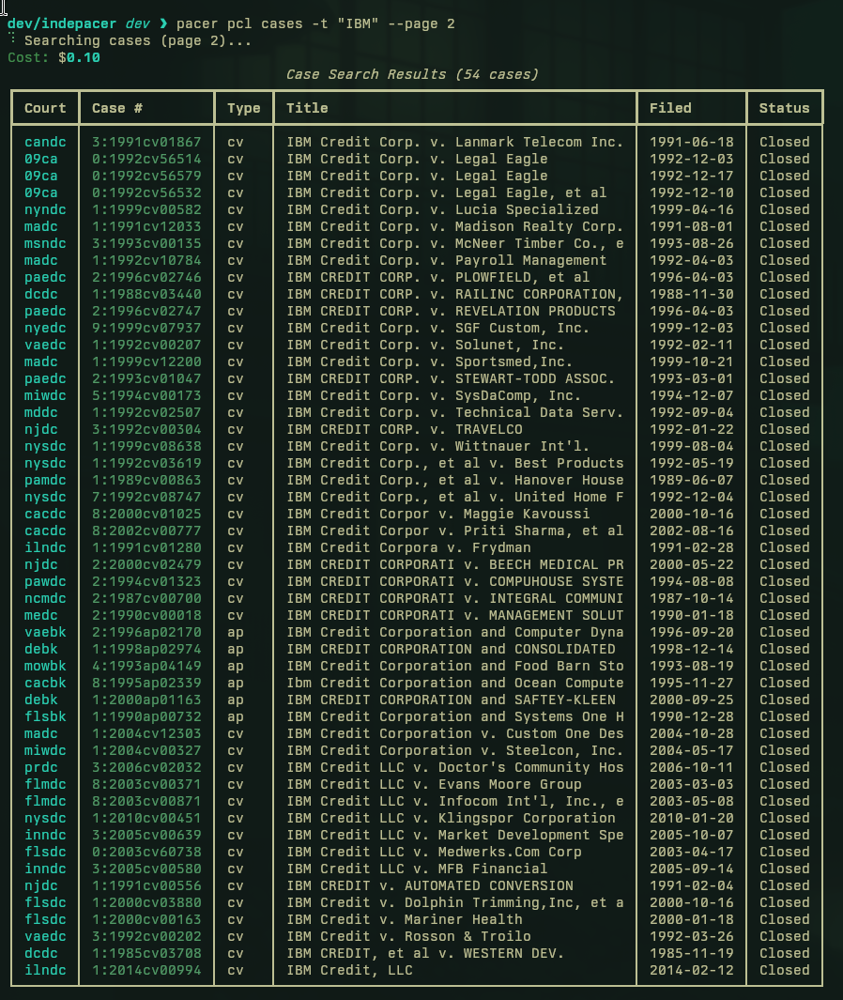

#  pacer-cli

[](https://github.com/johnzfitch/pacer-cli/actions/workflows/ci.yml)
[](https://pypi.org/project/pacer-cli/)
[](https://www.python.org/downloads/)
[](LICENSE)
[](#security)



A CLI for PACER (Public Access to Court Electronic Records) federal court research.

##  Installation
```bash
pip install pacer-cli

# With full parsing support (BeautifulSoup for legacy formats)
pip install 'pacer-cli[full]'
```

##  Quick Start

```bash
# 1. Configure credentials
pacer auth login

# 2. Search for cases (costs $0.10/page)
pacer pcl cases -t "Apple v. Samsung"

# 3. Download a docket (auto-sets context)
pacer download docket 1:18-cv-08434 nysd
#  → Saves to ~/.pacer/archives/nysd/1-18-cv-08434/
#  → Caches document links in docs.json
#  → Sets this case as active context

# 4. View the docket (uses context)
pacer view                    # summary
pacer view -v                 # all entries

# 5. List available documents
pacer docs                    # shows cached doc links

# 6. Download document 31 (URL auto-resolved!)
pacer download document 31

# 7. Search local archive
pacer grep "motion to dismiss"
```

### Interactive Workflow

```bash
# Search and act in one flow
pacer pcl cases -t "IBM" -c nysd -i
#  → Browse results with pagination
#  → Select a case
#  → Choose action: [d]ownload, [s]et context, [v]iew
```

### Command Aliases

| Short | Long Form | Description |
|-------|-----------|-------------|
| `pacer auth` | `pacer auth login` | Configure credentials |
| `pacer docket` | `pacer download docket` | Download docket |
| `pacer doc` | `pacer download document` | Download document |
| `pacer view` | `pacer view` | View parsed docket |
| `pacer docs` | `pacer docs` | List cached documents |
| `pacer grep` | `pacer search` | Search local files |

---

##  Command Reference

### Global Options

```
pacer [OPTIONS] COMMAND
  -y, --yes    Skip cost confirmation prompts
  --version    Show version
  --help       Show help
```

**Cost confirmation:** By default, commands that incur PACER charges prompt for confirmation. Use `-y` to skip:

```bash
pacer download docket 1:18-cv-08434 nysd      # prompts: "Proceed? [Y/n]"
pacer -y download docket 1:18-cv-08434 nysd   # no prompt
```

---

##  Authentication

### pacer auth login

Store PACER credentials securely.

```
pacer auth login [OPTIONS]

Options:
  -u, --username TEXT      PACER username (prompted if omitted)
  -p, --password TEXT      PACER password (prompted if omitted, hidden)
  -t, --totp-secret TEXT   TOTP secret for MFA (Base32 string)
  -c, --client-code TEXT   Client billing code (optional)
```

**Examples:**
```bash
# Interactive
pacer auth login

# Non-interactive
pacer auth login -u myuser -p mypass

# With MFA
pacer auth login -u myuser -p mypass -t JBSWY3DPEHPK3PXP
```

### pacer auth setup-mfa

Add MFA to existing account.

```
pacer auth setup-mfa [OPTIONS]

Options:
  -t, --totp-secret TEXT   TOTP secret (prompted if omitted)
```

Get the Base32 secret from PACER's "Manage My Account" MFA setup page.

### pacer auth test

Verify credentials work with PACER servers.

```
pacer auth test [OPTIONS]

Options:
  -o, --otp TEXT   Manual OTP code (if not using stored TOTP)
```

### pacer auth status

Display current authentication configuration.

```
pacer auth status
```

Shows: username, password status, MFA status, client code, environment.

### pacer auth logout

Remove stored credentials.

```
pacer auth logout
```

---

##  Context

The context system remembers your active case so you don't have to repeat court/case arguments.

### pacer use case

Set the active case context.

```
pacer use case COURT CASE_NUMBER

Arguments:
  COURT         Court identifier (e.g., nysd, cacd)
  CASE_NUMBER   Case number (e.g., 1:18-cv-08434)
```

**Example:**
```bash
pacer use case nysd 1:18-cv-08434
```

Context is also set automatically when you download a docket.

### pacer use status

Show current context and case info.

```
pacer use status
```

**Output:**
```
                         Active Context
┌──────────────┬───────────────────────────────────────────────┐
│ Court        │ NYSD                                          │
│ Case         │ 1:18-cv-08434                                 │
│ Path         │ /home/user/.pacer/archives/nysd/1-18-cv-08434 │
│ Docket       │ downloaded                                    │
│ Doc manifest │ cached                                        │
│ Documents    │ 2 PDF(s)                                      │
└──────────────┴───────────────────────────────────────────────┘
```

### pacer use clear

Clear the active context.

```
pacer use clear
```

---

##  Download

### pacer download docket

Download a case docket.

```
pacer download docket CASE_NUMBER COURT [OPTIONS]

Arguments:
  CASE_NUMBER   Case number (e.g., 1:18-cv-08434)
  COURT         Court identifier (e.g., nysd, cacd)

Options:
  -v, --verbose        Enable trace logging
  -l, --case-link URL  Direct CM/ECF case link (bypasses PCL search)
```

**Examples:**
```bash
# Standard download (searches PCL first)
pacer download docket 1:18-cv-08434 nysd

# With direct case link (faster, no PCL search)
pacer download docket 1:18-cv-08434 nysd \
  -l "https://ecf.nysd.uscourts.gov/cgi-bin/iqquerymenu.pl?500997"
```

**Output:**
```
~/.pacer/archives/nysd/1-18-cv-08434/
├── docket.html    # Full docket HTML
└── docs.json      # Cached document links
```

**Side effects:**
- Sets active context to this case
- Caches document links in `docs.json` for auto-resolution

**Cost:** ~$0.10 per page (typically 1-10 pages per docket)

### pacer download document

Download a document from a case.

```
pacer download document DOC_NUMBER [DOC_LINK] [OPTIONS]

Arguments:
  DOC_NUMBER   Document number in the docket
  DOC_LINK     Direct PACER document URL (optional if docs.json exists)

Options:
  -v, --verbose   Enable trace logging
```

**Examples:**
```bash
# With context set and docs.json cached (recommended)
pacer download document 31

# With explicit URL
pacer download document 31 "https://ecf.nysd.uscourts.gov/doc1/127149132"
```

**Output:** Saves to `~/.pacer/archives/{court}/{case}/documents/{doc_num}.pdf`

**Auto-resolution:** If `docs.json` exists (created during docket download), the document URL is resolved automatically from the cached manifest.

**Cost:** ~$0.10 per page

### pacer download batch

Download multiple dockets from a CSV file.

```
pacer download batch CSV_FILE [OPTIONS]

Arguments:
  CSV_FILE   Path to CSV file with case list

Options:
  -c, --column-court TEXT   Column name for court ID (default: court_id)
  -n, --column-case TEXT    Column name for case number (default: case_number)
  -v, --verbose             Enable trace logging
```

**CSV Format:**
```csv
court_id,case_number
almdce,2:00-cv-00084
azdce,2:98-cv-00020
nysdce,1:2018cv08434
```

**Example:**
```bash
pacer download batch cases.csv
pacer download batch cases.csv -c court -n case_num  # custom columns
```

---

##  Documents

### pacer docs

List documents from the cached `docs.json` manifest.

```
pacer docs [OPTIONS]

Options:
  --json   Output as JSON
```

**Example:**
```bash
# Uses active context
pacer docs

# Output
Documents in 1:18-cv-08434
┏━━━━━━━┳━━━━━━━━━━━━━━┳━━━━━━━━━━━━━━━━━━━━━━━━━━━━━━━━━━━━━━━┳━━━━━━━━┓
┃ #     ┃ Date         ┃ Description                           ┃ Attach ┃
┡━━━━━━━╇━━━━━━━━━━━━━━╇━━━━━━━━━━━━━━━━━━━━━━━━━━━━━━━━━━━━━━━╇━━━━━━━━┩
│ 1     │ 2018-09-17   │ COMPLAINT against IBM                 │        │
│ 3     │ 2018-09-17   │ MOTION for Pro Hac Vice               │ +2     │
│ 11    │ 2018-12-11   │ FIRST AMENDED COMPLAINT               │ +1     │
└───────┴──────────────┴───────────────────────────────────────┴────────┘
```

The `docs.json` manifest is created automatically when downloading a docket. Use document numbers with `pacer download document` for auto-resolved downloads.

---

##  View

### pacer view

View a parsed docket in human-readable format.

```
pacer view [DOCKET_FILE] [OPTIONS]

Arguments:
  DOCKET_FILE   Path to HTML docket file (optional if context is set)

Options:
  -f, --format TEXT   Output format: compact, markdown, json (default: compact)
  -v, --verbose       Show all entries (default: key entries only)
  -o, --output PATH   Save to file instead of stdout
```

**Examples:**
```bash
# Uses active context
pacer view
pacer view -v              # all entries
pacer view --format json   # JSON output

# Explicit file
pacer view ~/.pacer/archives/nysd/1-18-cv-08434/docket.html
```

**Sample Output:**
```yaml
# PACER Docket: 1:18-cv-08434-VEC-SLC
court: NYSD
filed: 2018-09-17
judge: Valerie E. Caproni
nos: 442 Civil Rights: Jobs
entries: 325

## Key Filings
2018-09-17 [1] COMPLAINT against IBM - Age discrimination
2018-12-11 [11] FIRST AMENDED COMPLAINT
2023-03-27 [350] JUDGMENT - Case closed
```

---

## Parse

Commands for batch parsing of docket archives.

### pacer parse all

Parse all dockets in the archive and export to CSV/JSON.

```
pacer parse all [OPTIONS]

Options:
  -i, --input-dir PATH   Input directory (default: ~/.pacer/archives)
```

**Output:** Creates CSV and JSON files with extracted metadata.

### pacer parse file

Parse a single docket file with metadata extraction.

```
pacer parse file DOCKET_FILE [OPTIONS]

Arguments:
  DOCKET_FILE   Path to HTML docket file

Options:
  --json   Output as JSON instead of table
```

**Example:**
```bash
pacer parse file ~/.pacer/archives/nysd/1-18-cv-08434/docket.html --json
```

> **Note:** For interactive viewing, use `pacer view` instead.

---

##  Search

### pacer search

Search parsed docket entries for keywords.

```
pacer search [OPTIONS]

Options:
  -r, --require TEXT    Required term (repeatable, all must match)
  -e, --exclude TEXT    Excluded term (repeatable, none can match)
  -w, --within INT      Terms must appear within N characters
  -o, --output PATH     Output filename prefix
  --individual          Write separate files per case
```

**Examples:**
```bash
# Basic search
pacer search -r motion -r dismiss

# Exclude terms
pacer search -r settlement -e denied

# Proximity search
pacer search -r "summary judgment" -w 100

# Save results
pacer search -r order -o results
pacer search -r order -o results --individual
```

---

##  PCL (PACER Case Locator)

Search the nationwide federal court case index.

**Cost:** $0.10 per page (54 results per page)

### pacer pcl cases

Search for cases.

```
pacer pcl cases [OPTIONS]

Search Criteria:
  -n, --case-number TEXT     Full case number (e.g., 1:2020cv12345)
  -t, --title TEXT           Case title (starts-with match)
  -c, --court TEXT           Court ID or region (repeatable)
  -j, --jurisdiction TYPE    ap|bk|cr|cv|mdl
  --case-type TEXT           Case type code (repeatable)

Date Filters:
  --filed-after DATE         Filed from (YYYY-MM-DD)
  --filed-before DATE        Filed to (YYYY-MM-DD)
  --closed-after DATE        Closed from (YYYY-MM-DD)
  --closed-before DATE       Closed to (YYYY-MM-DD)

Case Filters:
  --nature-of-suit, --nos TEXT   Nature of suit code (repeatable)
  --chapter TEXT                 Bankruptcy chapter (repeatable)

Pagination:
  --page INT        Page number, 0-indexed (default: 0)
  --all-pages       Fetch all pages (may incur significant costs)

Output:
  --json            Output as JSON
  --csv             Output as CSV
  -o, --output PATH Output file
  --dry-run         Show parameters without executing (no cost)

Interactive:
  -i, --interactive   Browse results and select cases to act on
```

**Examples:**
```bash
# By title
pacer pcl cases -t "Apple"
pacer pcl cases -t "Smith v. Jones"

# By court and date
pacer pcl cases -c nysd --filed-after 2023-01-01
pacer pcl cases -c CA -c NY --filed-after 2020-01-01

# By case type
pacer pcl cases --jurisdiction cv --nos 830  # Patent cases
pacer pcl cases --jurisdiction bk --chapter 11  # Chapter 11 bankruptcy

# Interactive mode - browse, select, and act
pacer pcl cases -t "IBM" -c nysd -i
#  → Paginated results display
#  → Select with number (or "1,3,5-10" for multi-select)
#  → Choose action: [d]ownload, [s]et context, [v]iew

# Pagination
pacer pcl cases -t "Contract" --page 2
pacer pcl cases -t "Contract" --all-pages --csv -o contracts.csv

# Dry run (no cost)
pacer pcl cases -t "Test" --dry-run
```

**Nature of Suit Codes (common):**
| Code | Description |
|------|-------------|
| 110 | Insurance |
| 190 | Contract |
| 440 | Civil Rights |
| 710 | Labor |
| 830 | Patent |
| 840 | Trademark |

### pacer pcl parties

Search for parties in cases.

```
pacer pcl parties [OPTIONS]

Party Criteria:
  -l, --last-name TEXT    Last name or company name
  -f, --first-name TEXT   First name
  --middle-name TEXT      Middle name
  --exact-match           Require exact name match
  --ssn TEXT              SSN (bankruptcy debtors only)
  --role TEXT             Party role code (repeatable)

Case Filters:
  -c, --court TEXT             Court ID (repeatable)
  -j, --jurisdiction TYPE      ap|bk|cr|cv|mdl
  --filed-after/before DATE    Date range
  --closed-after/before DATE   Date range
  --nos TEXT                   Nature of suit (repeatable)
  --chapter TEXT               Bankruptcy chapter (repeatable)

Pagination & Output:
  --page INT        Page number (default: 0)
  --all-pages       Fetch all pages
  --json            JSON output
  --csv             CSV output
  -o, --output PATH Output file
  --dry-run         Preview without cost
```

**Examples:**
```bash
# By name
pacer pcl parties -l "Smith" -f "John"
pacer pcl parties -l "Apple Inc" --jurisdiction cv

# Company search
pacer pcl parties -l "Microsoft" --filed-after 2020-01-01

# SSN search (bankruptcy only)
pacer pcl parties --ssn 123456789 --jurisdiction bk

# Export
pacer pcl parties -l "Smith" --all-pages --csv -o smith_cases.csv
```

### pacer pcl batch

Manage batch searches for large result sets (>5,400 results).

```
pacer pcl batch list [OPTIONS]
  --type cases|parties   Search type (default: cases)

pacer pcl batch start-cases [OPTIONS]
  (Same options as pcl cases)

pacer pcl batch start-parties [OPTIONS]
  (Same options as pcl parties)

pacer pcl batch status REPORT_ID [OPTIONS]
  --type cases|parties   Search type (default: cases)

pacer pcl batch download REPORT_ID [OPTIONS]
  --type cases|parties   Search type (default: cases)
  -o, --output PATH      Output file (required)

pacer pcl batch delete REPORT_ID [OPTIONS]
  --type cases|parties   Search type (default: cases)
```

**Workflow:**
```bash
# 1. Start batch job
pacer pcl batch start-cases -t "Bankruptcy" --chapter 11

# 2. Check status (note the report ID from step 1)
pacer pcl batch status 1078

# 3. Download when complete
pacer pcl batch download 1078 -o results.json

# 4. Clean up
pacer pcl batch delete 1078
```

**Limits:** Max 108,000 results per batch search.

---

## Utilities

### pacer courts

List federal court identifiers.

```
pacer courts
```

**Common Courts:**
| ID | Court |
|----|-------|
| nysdce | New York Southern District |
| nyedce | New York Eastern District |
| cacdce | California Central District |
| candce | California Northern District |
| txsdce | Texas Southern District |
| txndce | Texas Northern District |
| ilndce | Illinois Northern District |
| flsdce | Florida Southern District |
| madce | Massachusetts District |
| padece | Pennsylvania Eastern District |

**ID Format:** `{state}{district}dce`
- State: 2-letter code (ny, ca, tx, etc.)
- District: n=northern, s=southern, e=eastern, w=western, m=middle, c=central
- Suffix: dce (district court electronic)

### pacer config

Show current configuration.

```
pacer config
```

Shows: username, password status, output directories.

---

##  Configuration

### Credentials

Stored in `~/.config/pacer-cli/config.env` (mode 600):

```env
PACER_USERNAME=myuser
PACER_PASSWORD=mypassword
PACER_TOTP_SECRET=JBSWY3DPEHPK3PXP
PACER_CLIENT_CODE=MYCLIENT
```

### Environment Variables

| Variable | Description |
|----------|-------------|
| `PACER_USERNAME` | PACER username |
| `PACER_PASSWORD` | PACER password |
| `PACER_TOTP_SECRET` | Base32 TOTP secret for MFA |
| `PACER_CLIENT_CODE` | Client billing code |
| `PACER_USE_QA` | Set to "1" for QA environment |

### Archive Structure

Cases are stored in a hierarchical structure:

```
~/.pacer/
├── config/
│   └── context.json           # Active case context
└── archives/
    └── {court}/               # e.g., nysd/
        └── {case}/            # e.g., 1-18-cv-08434/
            ├── docket.html    # Full docket HTML
            ├── docs.json      # Document link manifest
            └── documents/     # Downloaded PDFs
                ├── 001.pdf
                └── 001-1.pdf  # Attachment
```

Credentials are stored separately in `~/.config/pacer-cli/config.env`.

---

##  Multi-Factor Authentication

PACER requires MFA for CM/ECF filing accounts by December 2025.

### Setup

1. Enable MFA in PACER's "Manage My Account" page
2. During setup, copy the **Base32 secret** shown below the QR code
3. Configure:

```bash
# During initial login
pacer auth login -t JBSWY3DPEHPK3PXP

# Or add to existing account
pacer auth setup-mfa -t JBSWY3DPEHPK3PXP
```

### Manual OTP

If automatic TOTP fails:
```bash
pacer auth test --otp 123456
```

---

##  Python API

```python
from pacer_cli.parser import parse_docket, parse_docket_file
from pacer_cli.reader import DocketParser
from pacer_cli.docket_types import ParsedDocket
from pathlib import Path

# Fast parsing
html = Path("docket.html").read_text()
docket: ParsedDocket = parse_docket(html)

# Access data
print(docket.meta.case_number)      # "1:18-cv-08434-VEC-SLC"
print(docket.meta.court_id)         # "nysd"
print(docket.meta.judge)            # "Valerie E. Caproni"
print(len(docket.entries))          # 325

# Key filings only
for entry in docket.key_entries(10):
    print(f"{entry.date} [{entry.doc_num}] {entry.text[:50]}")

# Output formats
print(docket.to_compact())   # YAML-like, LLM-friendly
print(docket.to_markdown())  # Human-readable
print(docket.to_json())      # Structured JSON

# File-based parsing
text = parse_docket_file(Path("docket.html"), "compact")
```

---

##  Costs

PACER charges per page viewed:

| Operation | Typical Cost |
|-----------|--------------|
| Docket download | $0.10-$1.00 (1-10 pages) |
| Document download | $0.10-$3.00 (1-30 pages) |
| PCL search | $0.10 per page (54 results/page) |
| PCL batch download | Varies by result count |

**Cost protection:**
- Commands prompt for confirmation before incurring charges (skip with `-y`)
- Use `--dry-run` for PCL searches to preview without cost
- Monitor with `pacer auth status` (shows PACER balance if available)

---

## Security

pacer-cli includes a security module (`security.py`) that protects your account and federal court system resources:

- **TLS 1.2+ enforcement** with ECDHE-only cipher suites (no deprecated DHE)
- **Rate limiting** (30 req/min default, configurable) to stay within PACER guidelines
- **Peak hours detection** (6AM-6PM Central, DST-aware via `zoneinfo`) with bulk download warnings
- **Streaming downloads** with memory limits to prevent OOM on large dockets
- **Audit logging** to `~/.pacer/logs/` for billing reconciliation
- **Secure credential storage** (file mode `0600`, Pydantic `SecretStr` for passwords)
- **Automatic retry** with exponential backoff on transient errors (429, 5xx)

Security configuration in `~/.config/pacer-cli/config.env`:

```bash
PACER_RATE_LIMIT=true          # Enable rate limiting
PACER_RATE_LIMIT_RPM=30        # Requests per minute
PACER_PEAK_WARNING=true        # Warn during PACER business hours
PACER_AUDIT_LOG=true           # Enable audit trail
PACER_TLS_LEVEL=standard       # standard | strict | paranoid
```

To report vulnerabilities, see [SECURITY.md](SECURITY.md).

---

## Development

```bash
# Install with dev dependencies
pip install -e '.[dev,full]'

# Run tests
pytest

# Run security review tests
pytest tests/test_security_review.py -v

# Lint
ruff check src/
```

See [CONTRIBUTING.md](CONTRIBUTING.md) for development guidelines.

---

## License

MIT
